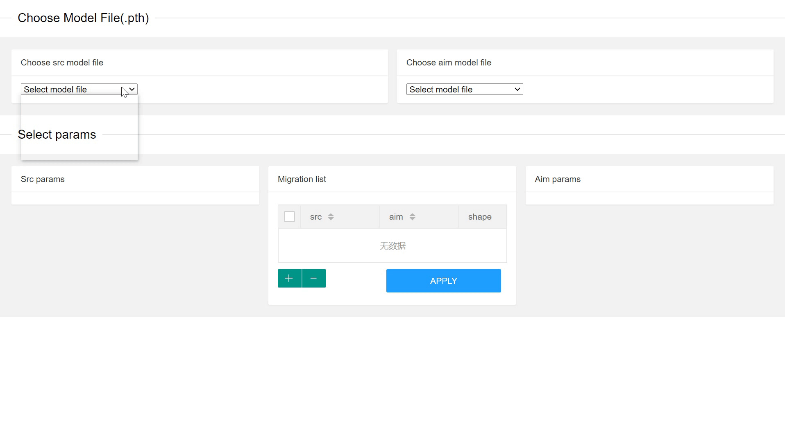

# model-param-migrate-tool-for-pytorch
一个可视化的模型参数迁移工具。可在异构的模型之间转移参数值，例如将VGG16的预训练模型中的部分层的参数转移至自己编写的模型中的部分层使用。转移的模型可以是异构的，模型参数的命名也可以不同，在参数树中选择好对应的转移关系即可。

仅支持pytorch常用的.pth模型。




## 环境
图形界面使用eel:
```
pip install eel
```
当然运行环境中必须要有torch

## 使用
1.将需要迁移的模型放在同一个文件夹中，默认的路径为"models"下，如果需要修改可在param_migrate.py中修改MODEL_DIR。

2.python param_migrate.py，执行后将使用本地的8000端口创建服务器，使用浏览器访问http://localhost:8000/main.html 即可打开操作界面。如果需要修改端口号，可在param_migrate.py的main()函数中修改。

3.在上面的Choose Model File面板中选择事先放在"../models"文件夹中的.pth文件，作为源模型src model(例：VGG预训练模型)和目标模型aim mode(例：自己编写的模型)

4.在Select params面板中选择需要进行迁移的参数对应关系。如下图即是将src model的encoder.8下的所有参数复制给aim model的en.conv3下的所有参数。选择好对应关系后，点“+”号按钮将对应关系加入面板中间的参数迁移列表中。

参数匹配采用这一策略：从两个params tree中被选中的最高子节点开始(图中src tree的'encoder.8'以及aim tree中的'en.conv3')，向下检查同名节点。当两个相对最高子节点的层级相同的节点同名时即匹配成功(例如src中的'encoder.8.0'与'en.conv3.0'即匹配成功)。当尝试匹配的两个节点为叶子节点时(例如src中的'encoder.8.0.weight'和'en.conv3.0.weight')时，还需要检查这两个节点的shape是否相同。

5.选择好所有需要迁移的参数对应关系后，点击“APPLY”按钮执行所有参数迁移。新模型参数文件名将保存为aim model的文件名称+'.migrate'，重命名去掉'.migrate'即可。同时也会生成一个.csv文件记录所有迁移的参数。

## 已发现的bug
1.没写过几次前端，不太明白为什么在一些浏览器中，选中params tree中的子节点时不会高亮（虽然确实选中了，可以'+'以及'APPLY'）。在我自己电脑上的chrome中没有问题。

2.很罕见的情况下，中间的Migration list的显示会有问题（一般是没有显示最新列表），因为还没出现过第二次，所以不知道原因。
